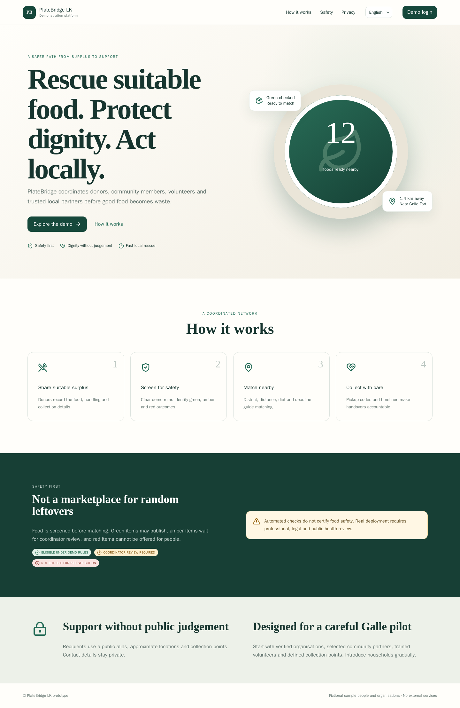
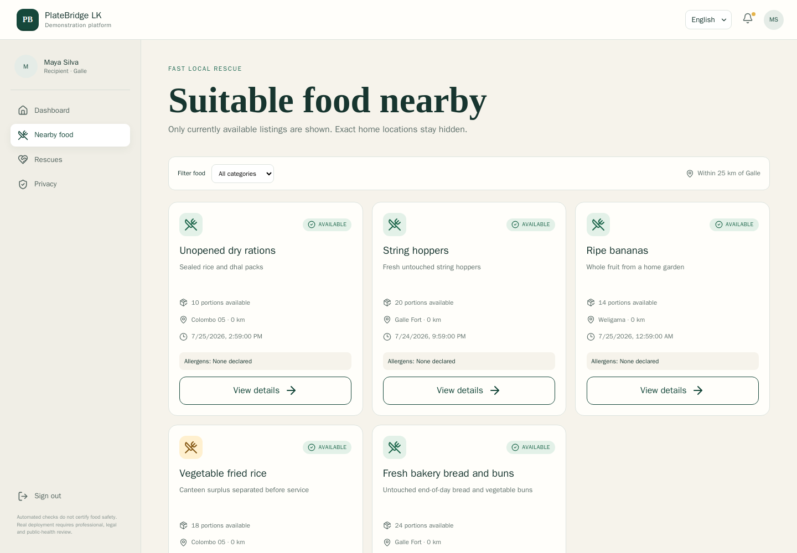
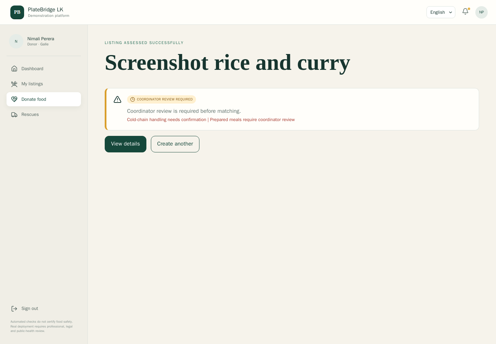
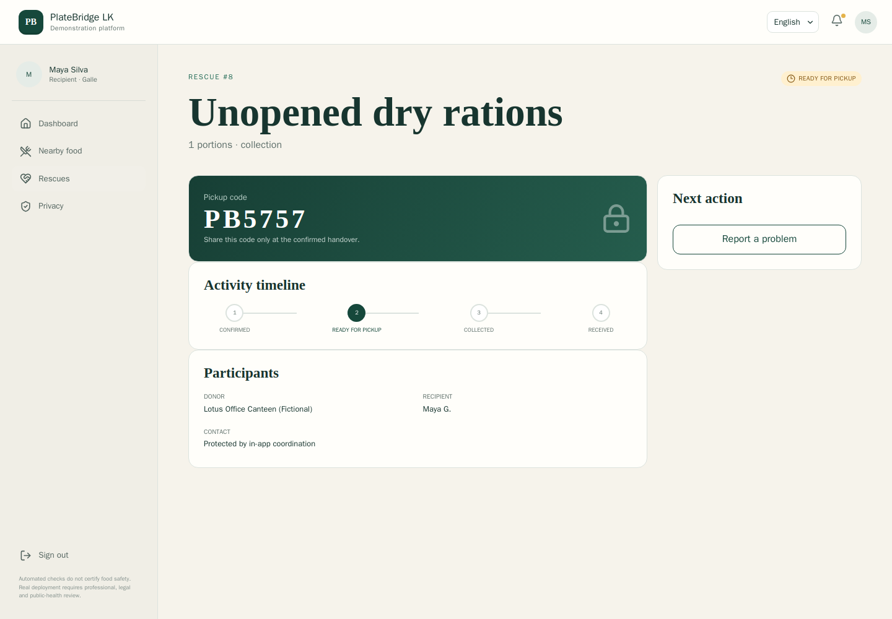

# PlateBridge LK

PlateBridge LK is a presentation-ready prototype for coordinating suitable surplus food in Sri Lanka. It connects household and organisation donors, recipients, volunteers, community coordinators and administrators through safety-screened, private and auditable rescue workflows.

> **Prototype disclaimer:** automated checks do not certify food safety. Real deployment requires rules approved by food-safety professionals, legal advisers, relevant public-health authorities and operating partners.

## Quick start

### Docker (recommended; Linux, macOS, Windows)

Prerequisite: Docker Desktop or Docker Engine with Compose.

```bash
docker compose up --build
```

Open <http://localhost:8080>. API docs are at <http://localhost:8000/docs>; health is at <http://localhost:8000/health>.

### Local — Linux/macOS

Prerequisites: Python 3.10+, Node.js 20+ and npm.

```bash
./scripts/setup.sh
./scripts/start.sh
```

Open <http://localhost:5173>.

### Local — Windows

Prerequisites: Python 3.10+ (`py` launcher), Node.js 20+ and PowerShell.

```bat
scripts\setup.cmd
scripts\start.cmd
```

PowerShell equivalents are `./scripts/setup.ps1` and `./scripts/start.ps1`. Windows paths, virtual-environment executables and `npm.cmd` are handled explicitly.

## What it looks like

<table>
  <tr>
    <td width="50%">
      
      <br /><strong>Public landing page</strong>
    </td>
    <td width="50%">
      
      <br /><strong>Nearby food discovery</strong>
    </td>
  </tr>
  <tr>
    <td width="50%">
      
      <br /><strong>Explainable safety screening</strong>
    </td>
    <td width="50%">
      
      <br /><strong>Auditable rescue handover</strong>
    </td>
  </tr>
</table>

More desktop, multilingual, role-specific, and mobile captures are available in [docs/screenshots](docs/screenshots/README.md).

## Demo accounts

Shared password: `demo123`

| Role | Account |
|---|---|
| Household donor | `donor.home@platebridge.demo` |
| Organisation donor | `donor.business@platebridge.demo` |
| Recipient | `recipient@platebridge.demo` |
| Volunteer | `volunteer@platebridge.demo` |
| Coordinator | `coordinator@platebridge.demo` |
| Administrator | `admin@platebridge.demo` |

All people and organisations in the dataset are fictional.

## Best demonstration

1. Start at the landing page and switch English/Sinhala/Tamil.
2. Sign in as household donor; create a cooked rice-and-curry listing. Its amber outcome waits for review.
3. Sign in as coordinator; open **Safety reviews** and approve it.
4. Sign in as recipient; open **Nearby food**, claim portions, and note the pickup code and public alias.
5. Sign in as organisation donor and create untouched bakery food for a green result.
6. Claim it as recipient with volunteer delivery; sign in as volunteer, accept, collect and deliver.
7. Confirm receipt as recipient; submit an incident to demonstrate the review queue.
8. Sign in as administrator for users, rules, metrics and deterministic reset.

The exact 7–10 minute narration is in [docs/DEMO_SCRIPT.md](docs/DEMO_SCRIPT.md).

## Reset, test and quality checks

```bash
./scripts/reset-demo.sh
./scripts/test.sh
cd frontend && npm run e2e
```

For a running Docker stack, reset with `docker compose exec backend python -m app.seed` or use the administrator's **Reset demo data** control.

Windows: `scripts\reset-demo.cmd` and `powershell -File scripts\test.ps1`.

## Architecture

- React 18 + TypeScript + Vite responsive PWA shell
- i18next locale resources for English, Sinhala and Tamil
- FastAPI + Pydantic REST API
- SQLAlchemy entities and persistent SQLite demo database
- Deterministic seed/reset and stored audit events
- pytest, Vitest and Playwright coverage
- Docker Compose production-style local packaging with Nginx API proxy

Product naming, demo password, safety window and search radius are centrally configurable through `.env`/backend configuration. See [docs/ARCHITECTURE.md](docs/ARCHITECTURE.md).

## Documentation

[Vision](docs/PRODUCT_VISION.md) · [Goals](docs/GOALS_AND_NON_GOALS.md) · [Roles](docs/USER_ROLES.md) · [Flows](docs/USER_FLOWS.md) · [Safety](docs/SAFETY_MODEL.md) · [Architecture](docs/ARCHITECTURE.md) · [Data](docs/DATA_MODEL.md) · [API](docs/API_REFERENCE.md) · [Localisation](docs/LOCALISATION_REVIEW.md) · [Privacy](docs/PRIVACY_AND_DIGNITY.md) · [Test plan](docs/TEST_PLAN.md) · [Assumptions](docs/ASSUMPTIONS_AND_LIMITATIONS.md) · [Decisions](docs/DECISIONS.md) · [Roadmap](docs/ROADMAP.md) · [Screenshots](docs/screenshots/README.md)

## Known limitations

This is not production-ready. Authentication is deliberately obvious demo authentication; no identity verification, real notifications, SMS, live maps, professional safety certification or production infrastructure is included. Straight-line distance and demo rules are coordination aids only. Language must receive native-speaker review before a pilot.
