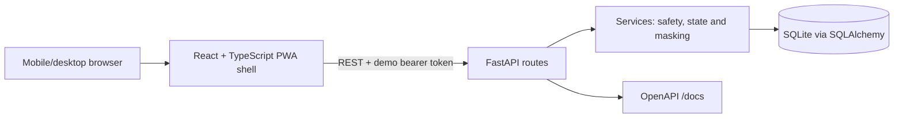
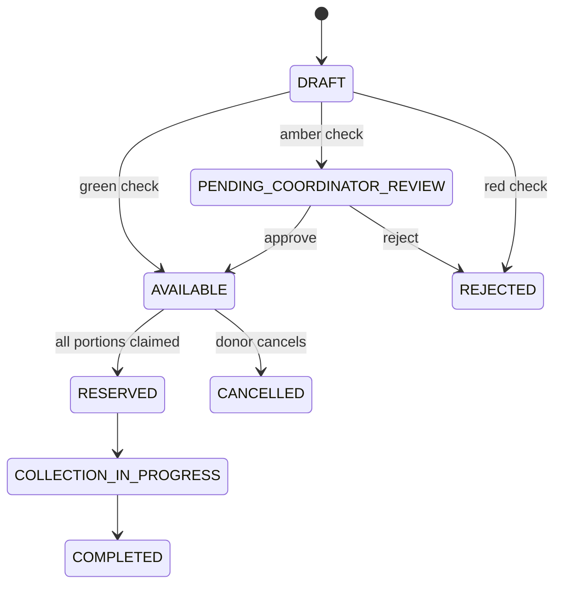
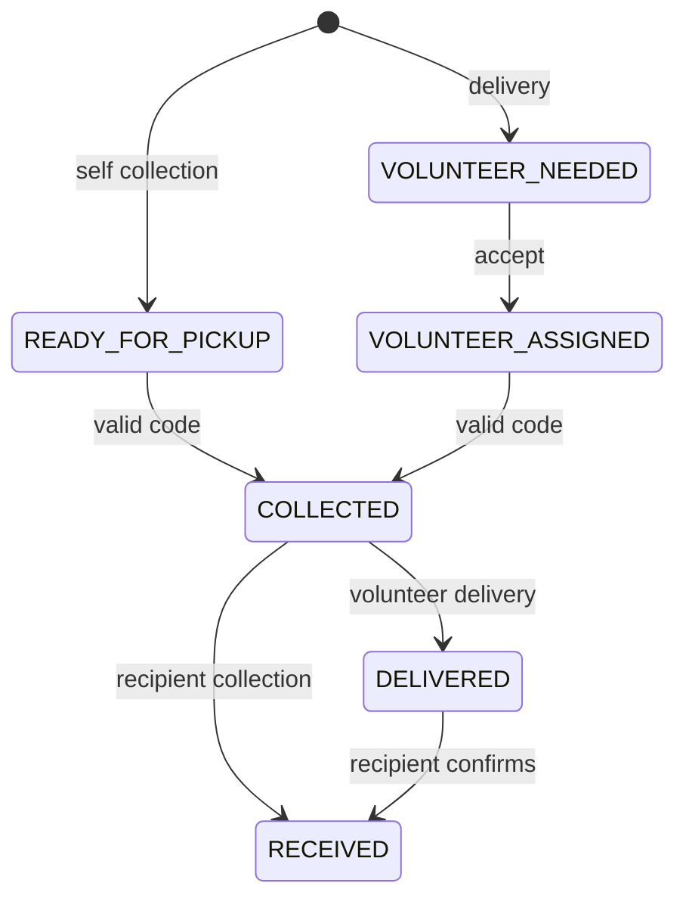

# Architecture

## System overview

The Vite client owns presentation, responsive role navigation, i18next resources and graceful API errors. FastAPI owns authentication, role authorization, validation, state transitions and public masking. SQLAlchemy maps users, listings, rescues, collection points, incidents, messages, notifications, audit events and safety rules to a persisted SQLite volume.

## Authentication and privacy

`POST /api/auth/demo-login` accepts one of the seeded emails and shared password. The returned `demo-{id}` bearer token is intentionally not production-grade. Protected endpoints resolve the active user and check roles. Recipient names are masked to an alias outside coordinator/admin views. Precise coordinates are stored only to calculate straight-line distance and are never returned as public location data.

## State models

Routes reject invalid transitions with HTTP 409. Important actions create audit events. The prototype implements the transitions required for the demo; additional suggested labels remain roadmap states.

## Localisation, PWA and testing

Locale JSON files are loaded through i18next, language persists in `localStorage`, and the document `lang` changes. The manifest/icon provide an installable shell; complex offline mutation is intentionally excluded. pytest covers engine/API rules, Vitest covers visible classifications/localisation, and Playwright covers recipient and donor workflows.

