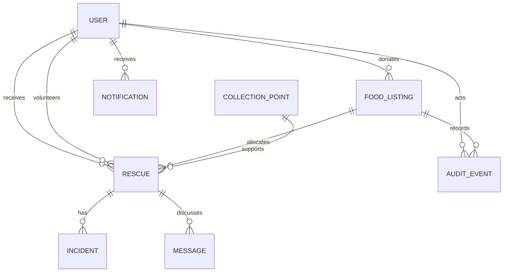

# Data model

- **User**: demo identity, role, donor type/organisation, district, approximate area/coordinates, language, alias, privacy and active state.
- **FoodListing**: structured food, preparation, storage, diet/allergen, packaging, approximate collection, classification, explanation, availability and status fields.
- **Rescue**: listing allocation, recipient, portions, fulfilment, collection point, pickup code, volunteer, status and incident flag.
- **CollectionPoint**: fictional shared location, hours, contact instructions and storage capability.
- **Incident**: reporter, rescue, category, severity, status and review/resolution notes.
- **Message/Notification**: in-app-only coordination records without phone exposure.
- **AuditEvent**: entity/action/actor/detail/time for material transitions.
- **SafetyRule**: visible configuration records. Runtime limits use environment-backed central configuration in this prototype.

Safety attributes are columns rather than an opaque JSON blob. A future schema migration would split reusable food attributes and assessments into versioned entities.

